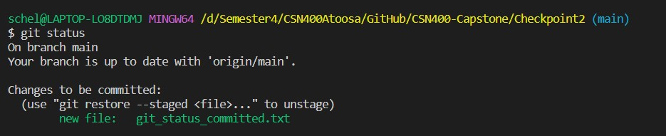
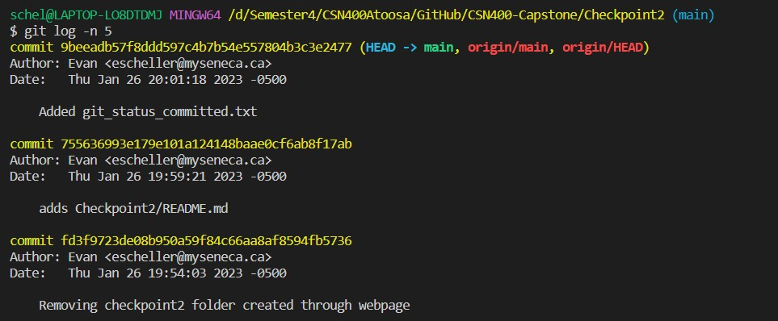

# Checkpoint2 Submission

- **COURSE INFORMATION: CSN400NAA**
- **STUDENT’S NAME: Evan Scheller**
- **STUDENT'S NUMBER: 183766211**
- **GITHUB USER ID: 183766211-myseneca**
- **TEACHER’S NAME: Atoosa Nasiri**

### Table of Contents
1. [Part A - Adding Files - Local Repo Workflow](#part-a---adding-files---local-repo-workflow)
2. [Part B - Inspecting Local Repo](#part-b---inspecting-local-repo)
3. [Part C - Creating and Merging Branches](#part-c---creating-and-merging-branches)
4. [Part D - Git Branching Strategy Review Questions](#part-d---git-branching-strategy-review-questions)

# Part A - Adding Files - Local Repo Workflow

# Part B - Inspecting Local Repo
`git status` is a command used to display information about the current working state of the repository compared to the state that was pushed previously, whereas `git log` displays changes which have been committed and when.

Here is an image showing an example of `git status`:



Here is an image showing an example of `git log`



# Part C - Creating and Merging Branches
Here is the output of `git log -n 5`, displaying the created branch and following merge.

```schel@LAPTOP-LO8DTDMJ MINGW64 /d/Semester4/CSN400Atoosa/GitHub/CSN400-Capstone/Checkpoint2 (feat-emojis)
$ git checkout main
Switched to branch 'main'
Your branch is up to date with 'origin/main'.

schel@LAPTOP-LO8DTDMJ MINGW64 /d/Semester4/CSN400Atoosa/GitHub/CSN400-Capstone/Checkpoint2 (main)
$ git merge feat-emojis 
Updating 3057cc0..6e43f9d
Fast-forward
 Checkpoint2/emojis/emoji-rendered.png | 2865 ++++++++++++++++++++++++++++++++
 Checkpoint2/emojis/tips-emojis.md     | 2920 +++++++++++++++++++++++++++++++++
 2 files changed, 5785 insertions(+)
 create mode 100644 Checkpoint2/emojis/emoji-rendered.png
 create mode 100644 Checkpoint2/emojis/tips-emojis.md

schel@LAPTOP-LO8DTDMJ MINGW64 /d/Semester4/CSN400Atoosa/GitHub/CSN400-Capstone/Checkpoint2 (main)
$ git log -n 5
commit 6e43f9dfb821da8e028540c83698a8e8a278b641 (HEAD -> main, origin/feat-emojis, feat-emojis)
Author: Evan <escheller@myseneca.ca>
Date:   Thu Jan 26 20:11:37 2023 -0500

    adds emojis to feat-emojis branch

commit 3057cc06f7e3f372d8cafd850e4bdff41cfc08c4 (origin/main, origin/HEAD)
Author: Evan <escheller@myseneca.ca>
Date:   Thu Jan 26 20:07:21 2023 -0500

    Added footnotes folder and content

commit 9beeadb57f8ddd597c4b7b54e557804b3c3e2477
Author: Evan <escheller@myseneca.ca>
Date:   Thu Jan 26 20:01:18 2023 -0500

    Added git_status_committed.txt

commit 755636993e179e101a124148baae0cf6ab8f17ab
Author: Evan <escheller@myseneca.ca>
Date:   Thu Jan 26 19:59:21 2023 -0500

    adds Checkpoint2/README.md

On branch main
Your branch is ahead of 'origin/main' by 1 commit.
  (use "git push" to publish your local commits)

nothing to commit, working tree clean
```

# Part D - Git Branching Strategy Review Questions
1. What are the differences between `develop` branch and `main` branch?
2. What are the three supporting branches? Briefly describe the function of each of these supporting branches.
3. What re the best practices in working with `release` branches?