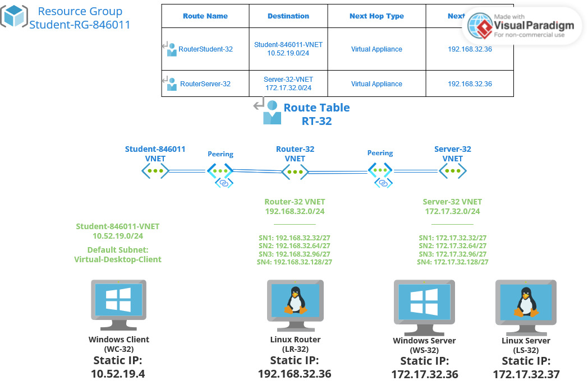

# Checkpoint4 Submission

- **COURSE INFORMATION: CSN400NAA**
- **STUDENT’S NAME: Evan Scheller**
- **STUDENT'S NUMBER: 183766211**
- **GITHUB USER ID: 183766211-myseneca**
- **TEACHER’S NAME: Atoosa Nasiri**


### Table of Contents
1. [Part A - Creating Your Unique Network Topology](#part-a---creating-your-unique-network-topology)
2. [Part C - Working in Azure CLI Bash](#part-c---working-in-azure-cli-bash)


## Part A - Creating Your Unique Network Topology



Made using [Visual Paradigm Online](https://online.visual-paradigm.com/).


## Part C - Working in Azure CLI Bash
1. [List of all VNets](https://github.com/183766211-myseneca/CSN400-Capstone/blob/main/Checkpoint4/vnet_list.json)
2. [Details of default student VNet](https://github.com/183766211-myseneca/CSN400-Capstone/blob/main/Checkpoint4/student_vnet.json)
3. [List of all peerings](https://github.com/183766211-myseneca/CSN400-Capstone/blob/main/Checkpoint4/peerings.tbl)
4. Details of Router-32 subnet SN1, output of:<br> `az network vnet subnet show -g "Student-RG-846011" -n "SN1" --vnet-name "Server-32" --query "[type, addressPrefix, routeTable]"`<br>
```
[
  "Microsoft.Network/virtualNetworks/subnets",
  "172.17.32.32/27",
  {
    "id": "/subscriptions/bd627181-5ddb-4bb6-b03f-5297c3be4e1e/resourceGroups/Student-RG-846011/providers/Microsoft.Network/routeTables/RT-32",
    "resourceGroup": "Student-RG-846011"
  }
]
```
5. [List of all routes in RT-32](https://github.com/183766211-myseneca/CSN400-Capstone/blob/main/Checkpoint4/route_list.tbl)
6. [Details of route between Router-32 SN1 and Server-32 SN](https://github.com/183766211-myseneca/CSN400-Capstone/blob/main/Checkpoint4/route_details.json)

