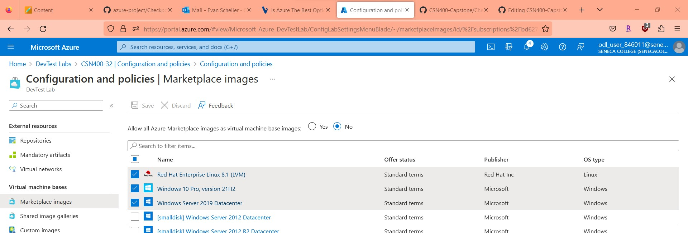
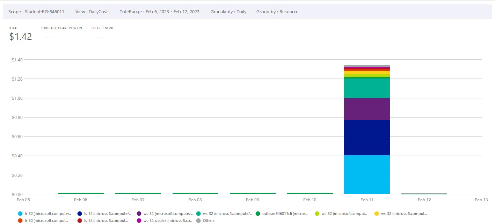

# Checkpoint5 Submission

- **COURSE INFORMATION: CSN400NAA**
- **STUDENT’S NAME: Evan Scheller**
- **STUDENT'S NUMBER: 183766211**
- **GITHUB USER ID: 183766211-myseneca**
- **TEACHER’S NAME: Atoosa Nasiri**

 
### Table of Contents

1. [Part A - Creating Resources in Azure Portal](#part-a---creating-resources-in-azure-portal)
2. [Part B - Working with az lab CLI command](#part-b---working-with-az-lab-cli-command)
3. [Part C - Creating VMs using Azure Resource Manager (ARM) and Custom Images](#part-c---creating-vms-using-azure-resource-manager-arm-and-custom-images)
4. [Part D - Azure Cost Analysis Charts](#part-d---azure-cost-analysis-charts)

## Part A - Creating Resources in Azure Portal
DevTest Lab 
 

DevTest VM config and policy
<br>


DevTest VNets


DevTest Allowed Images


## Part B - Working with `az lab` CLI command
Isolate `name` property in `devtest_lab.json`.

`grep "name" devtest_lab.json `
```
  "name": "CSN400-32",
```

 Links to JSON and tables for DevTest Lab:

 1. [CSN400-32 Lab JSON](https://github.com/183766211-myseneca/CSN400-Capstone/blob/main/Checkpoint5/devtest_lab.json)
 2. [List of custom images](https://github.com/183766211-myseneca/CSN400-Capstone/blob/main/Checkpoint5/custom_images.tbl)
 3. [List of VNets](https://github.com/183766211-myseneca/CSN400-Capstone/blob/main/Checkpoint5/lab_vnets.tbl)
 4. [List of VMs](https://github.com/183766211-myseneca/CSN400-Capstone/blob/main/Checkpoint5/lab_vm.tbl)

## Part C - Creating VMs using Azure Resource Manager ARM and Custom Images

 `az lab custom-image list --lab-name "CSN400-32" --resource-group "Student-RG-846011"`

 ```
 [
  {
    "author": "odl_user_846011@seneca-csn400naa.cloudlabs.ai",
    "creationDate": "2023-02-11T20:23:10.241056+00:00",
    "customImagePlan": null,
    "dataDiskStorageInfo": null,
    "description": "Tasks completed:\nNo connection, no setup",
    "id": "/subscriptions/bd627181-5ddb-4bb6-b03f-5297c3be4e1e/resourcegroups/student-rg-846011/providers/microsoft.devtestlab/labs/csn400-32/customimages/ws-img-v01",
    "isPlanAuthorized": null,
    "location": null,
    "managedImageId": null,
    "managedSnapshotId": "/subscriptions/bd627181-5ddb-4bb6-b03f-5297c3be4e1e/resourcegroups/student-rg-846011/providers/microsoft.compute/snapshots/ws-img-v01",
    "name": "WS-img-v01",
    "provisioningState": "Succeeded",
    "resourceGroup": "student-rg-846011",
    "tags": null,
    "type": "Microsoft.DevTestLab/labs/customImages",
    "uniqueIdentifier": "594cc5d7-9bd3-494c-811b-9c38d075f263",
    "vhd": null,
    "vm": {
      "linuxOsInfo": null,
      "sourceVmId": "/subscriptions/bd627181-5ddb-4bb6-b03f-5297c3be4e1e/resourcegroups/student-rg-846011/providers/microsoft.devtestlab/labs/csn400-32/virtualmachines/ws-32",
      "windowsOsInfo": {
        "windowsOsState": "NonSysprepped"
      }
    }
  },
  {
    "author": "odl_user_846011@seneca-csn400naa.cloudlabs.ai",
    "creationDate": "2023-02-11T20:24:22.985738+00:00",
    "customImagePlan": null,
    "dataDiskStorageInfo": null,
    "description": "Tasks completed:\nNo configuration, no setup",
    "id": "/subscriptions/bd627181-5ddb-4bb6-b03f-5297c3be4e1e/resourcegroups/student-rg-846011/providers/microsoft.devtestlab/labs/csn400-32/customimages/ls-img-v01",
    "isPlanAuthorized": null,
    "location": null,
    "managedImageId": null,
    "managedSnapshotId": "/subscriptions/bd627181-5ddb-4bb6-b03f-5297c3be4e1e/resourcegroups/student-rg-846011/providers/microsoft.compute/snapshots/ls-img-v01",
    "name": "LS-img-v01",
    "provisioningState": "Succeeded",
    "resourceGroup": "student-rg-846011",
    "tags": null,
    "type": "Microsoft.DevTestLab/labs/customImages",
    "uniqueIdentifier": "01705c4e-d08b-4030-a60e-fe67c1d9dff6",
    "vhd": null,
    "vm": {
      "linuxOsInfo": {
        "linuxOsState": "NonDeprovisioned"
      },
      "sourceVmId": "/subscriptions/bd627181-5ddb-4bb6-b03f-5297c3be4e1e/resourcegroups/student-rg-846011/providers/microsoft.devtestlab/labs/csn400-32/virtualmachines/ls-32",
      "windowsOsInfo": null
    }
  },
  {
    "author": "odl_user_846011@seneca-csn400naa.cloudlabs.ai",
    "creationDate": "2023-02-11T20:25:54.996058+00:00",
    "customImagePlan": null,
    "dataDiskStorageInfo": null,
    "description": "Tasks completed:\nadded linuxkey and tested, working",
    "id": "/subscriptions/bd627181-5ddb-4bb6-b03f-5297c3be4e1e/resourcegroups/student-rg-846011/providers/microsoft.devtestlab/labs/csn400-32/customimages/lr-img-v01",
    "isPlanAuthorized": null,
    "location": null,
    "managedImageId": null,
    "managedSnapshotId": "/subscriptions/bd627181-5ddb-4bb6-b03f-5297c3be4e1e/resourcegroups/student-rg-846011/providers/microsoft.compute/snapshots/lr-img-v01",
    "name": "LR-img-v01",
    "provisioningState": "Succeeded",
    "resourceGroup": "student-rg-846011",
    "tags": null,
    "type": "Microsoft.DevTestLab/labs/customImages",
    "uniqueIdentifier": "72662cd4-facc-4cc8-b858-61079054a0cd",
    "vhd": null,
    "vm": {
      "linuxOsInfo": {
        "linuxOsState": "NonDeprovisioned"
      },
      "sourceVmId": "/subscriptions/bd627181-5ddb-4bb6-b03f-5297c3be4e1e/resourcegroups/student-rg-846011/providers/microsoft.devtestlab/labs/csn400-32/virtualmachines/lr-32",
      "windowsOsInfo": null
    }
  },
  {
    "author": "odl_user_846011@seneca-csn400naa.cloudlabs.ai",
    "creationDate": "2023-02-11T20:27:02.678291+00:00",
    "customImagePlan": null,
    "dataDiskStorageInfo": null,
    "description": "Tasks completed:\nAdded linuxkey, changed extension, tested",
    "id": "/subscriptions/bd627181-5ddb-4bb6-b03f-5297c3be4e1e/resourcegroups/student-rg-846011/providers/microsoft.devtestlab/labs/csn400-32/customimages/wc-img-v01",
    "isPlanAuthorized": null,
    "location": null,
    "managedImageId": null,
    "managedSnapshotId": "/subscriptions/bd627181-5ddb-4bb6-b03f-5297c3be4e1e/resourcegroups/student-rg-846011/providers/microsoft.compute/snapshots/wc-img-v01",
    "name": "WC-img-v01",
    "provisioningState": "Succeeded",
    "resourceGroup": "student-rg-846011",
    "tags": null,
    "type": "Microsoft.DevTestLab/labs/customImages",
    "uniqueIdentifier": "9dca39a8-db60-40a6-a987-a912d7ff8898",
    "vhd": null,
    "vm": {
      "linuxOsInfo": null,
      "sourceVmId": "/subscriptions/bd627181-5ddb-4bb6-b03f-5297c3be4e1e/resourcegroups/student-rg-846011/providers/microsoft.devtestlab/labs/csn400-32/virtualmachines/wc-32",
      "windowsOsInfo": {
        "windowsOsState": "NonSysprepped"
      }
    }
  }
]
```
## Part D - Azure Cost Analysis Charts

Daily resource cost of last 7 days.


Daily service cost of last 7 days.


Accumulated resource cost area chart, last 7 days.


Cost by service name, past 30 days.


Cost by service family, past 30 days.


Cost by product, past 30 days.
