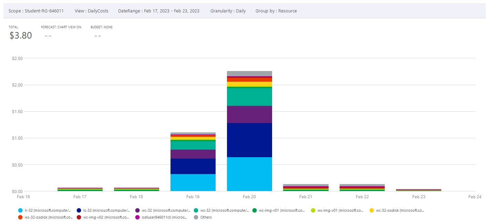
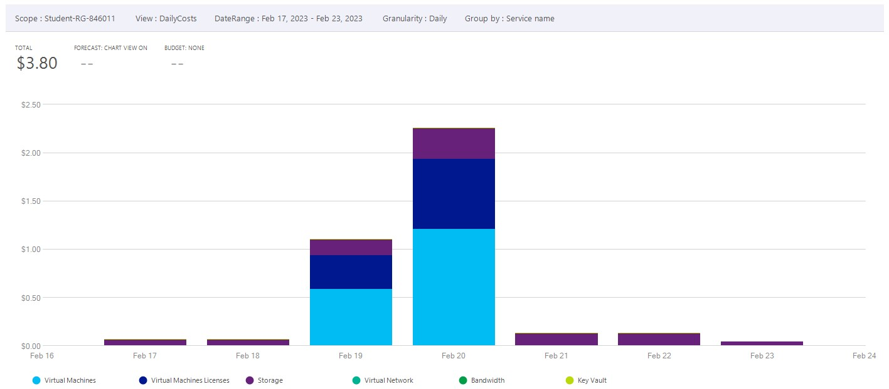

# Checkpoint6 Submission

- **COURSE INFORMATION: CSN400NAA**
- **STUDENT’S NAME: Evan Scheller**
- **STUDENT'S NUMBER: 183766211**
- **GITHUB USER ID: 183766211-myseneca**
- **TEACHER’S NAME: Atoosa Nasiri**

### Table of Contents

3. [Part C - Enable ip-forwarding in NIC](#part-c---enable-ip-forwarding-in-nic)
4. [Part D - Basic Connectivity](#part-d---basic-connectivity)
5. [Part E - Azure Cost Analysis Charts](#part-e---azure-cost-analysis-charts)

## Part C - Enable ip-forwarding in NIC
The status of ip-forwarding is held within this NIC, and the attribute name is `enableIpForwarding`, returning either True or False. The NIC attributes can be listed by the command `az network nic show -g MyResourceGroup -n MyNic`, and the specific attribute queried with `--query "enableIpForwarding"`.<br>
My command used is `az network nic show -g "Student-RG-846011" -n "lr-32" -o JSON`.
```{
  "auxiliaryMode": null,
  "dnsSettings": {
    "appliedDnsServers": [],
    "dnsServers": [],
    "internalDnsNameLabel": null,
    "internalDomainNameSuffix": null,
    "internalFqdn": null
  },
  "dscpConfiguration": null,
  "enableAcceleratedNetworking": false,
  "enableIpForwarding": true,
  "etag": "W/\"d38dc8ae-8b7b-43f3-863a-d9e56ac91385\"",
  "extendedLocation": null,
  "hostedWorkloads": [],
  "id": "/subscriptions/bd627181-5ddb-4bb6-b03f-5297c3be4e1e/resourceGroups/student-rg-846011/providers/Microsoft.Network/networkInterfaces/lr-32",
  "ipConfigurations": [
    {
      "applicationGatewayBackendAddressPools": null,
      "applicationSecurityGroups": null,
      "etag": "W/\"d38dc8ae-8b7b-43f3-863a-d9e56ac91385\"",
      "gatewayLoadBalancer": null,
      "id": "/subscriptions/bd627181-5ddb-4bb6-b03f-5297c3be4e1e/resourceGroups/student-rg-846011/providers/Microsoft.Network/networkInterfaces/lr-32/ipConfigurations/lr-32",
      "loadBalancerBackendAddressPools": null,
      "loadBalancerInboundNatRules": null,
      "name": "lr-32",
      "primary": true,
      "privateIpAddress": "192.168.32.36",
      "privateIpAddressVersion": "IPv4",
      "privateIpAllocationMethod": "Dynamic",
      "privateLinkConnectionProperties": null,
      "provisioningState": "Succeeded",
      "publicIpAddress": null,
      "resourceGroup": "student-rg-846011",
      "subnet": {
        "addressPrefix": null,
        "addressPrefixes": null,
        "applicationGatewayIpConfigurations": null,
        "delegations": null,
        "etag": null,
        "id": "/subscriptions/bd627181-5ddb-4bb6-b03f-5297c3be4e1e/resourceGroups/Student-RG-846011/providers/Microsoft.Network/virtualNetworks/Router-32/subnets/SN1",
        "ipAllocations": null,
        "ipConfigurationProfiles": null,
        "ipConfigurations": null,
        "name": null,
        "natGateway": null,
        "networkSecurityGroup": null,
        "privateEndpointNetworkPolicies": null,
        "privateEndpoints": null,
        "privateLinkServiceNetworkPolicies": null,
        "provisioningState": null,
        "purpose": null,
        "resourceGroup": "Student-RG-846011",
        "resourceNavigationLinks": null,
        "routeTable": null,
        "serviceAssociationLinks": null,
        "serviceEndpointPolicies": null,
        "serviceEndpoints": null,
        "type": null
      },
      "type": "Microsoft.Network/networkInterfaces/ipConfigurations",
      "virtualNetworkTaps": null
    }
  ],
  "kind": "Regular",
  "location": "canadacentral",
  "macAddress": "00-22-48-B3-00-8F",
  "migrationPhase": null,
  "name": "lr-32",
  "networkSecurityGroup": null,
  "nicType": "Standard",
  "primary": true,
  "privateEndpoint": null,
  "privateLinkService": null,
  "provisioningState": "Succeeded",
  "resourceGroup": "student-rg-846011",
  "resourceGuid": "f69ff802-391a-46ba-a8fd-e059e15edc10",
  "tags": {
    "DeploymentId": "846011",
    "LaunchId": "28959",
    "LaunchType": "ON_DEMAND_LAB",
    "TemplateId": "4678",
    "TenantId": "353",
    "hidden-DevTestLabs-LabUId": "adac863c-329c-43f2-9f7e-f171c2cae7f3",
    "hidden-DevTestLabs-LogicalResourceUId": "3514c14b-1899-4023-abcb-51f287595b6a"
  },
  "tapConfigurations": [],
  "type": "Microsoft.Network/networkInterfaces",
  "virtualMachine": {
    "id": "/subscriptions/bd627181-5ddb-4bb6-b03f-5297c3be4e1e/resourceGroups/student-rg-846011/providers/Microsoft.Compute/virtualMachines/LR-32",
    "resourceGroup": "student-rg-846011"
  },
  "vnetEncryptionSupported": false,
  "workloadType": null
}
```
The line `  "enableIpForwarding": true,` shows that IP forwarding is enabled.

## Part D - Basic Connectivity
`sudo iptables -nvL` on LR-32:
```
Chain INPUT (policy ACCEPT 0 packets, 0 bytes)
 pkts bytes target     prot opt in     out     source               destination
 7288 6892K ACCEPT     tcp  --  *      *       0.0.0.0/0            0.0.0.0/0            state RELATED,ESTABLISHED
    7   588 ACCEPT     icmp --  *      *       0.0.0.0/0            0.0.0.0/0
    6   360 ACCEPT     all  --  lo     *       0.0.0.0/0            0.0.0.0/0
    7   364 ACCEPT     tcp  --  *      *       10.52.19.0/24        0.0.0.0/0            state NEW tcp dpt:22
  121 22292 LOG        all  --  *      *       0.0.0.0/0            0.0.0.0/0            limit: avg 10/sec burst 5 LOG flags 0 level 4 prefix "TO_DROP_INPUT"
  121 22292 DROP       all  --  *      *       0.0.0.0/0            0.0.0.0/0

Chain FORWARD (policy ACCEPT 0 packets, 0 bytes)
 pkts bytes target     prot opt in     out     source               destination
  756 60434 ACCEPT     tcp  --  *      *       10.52.19.0/24        172.17.32.32/27      tcp dpt:22
  542 76934 ACCEPT     tcp  --  *      *       172.17.32.32/27      10.52.19.0/24        tcp spt:22
 1116  117K ACCEPT     tcp  --  *      *       10.52.19.0/24        172.17.32.32/27      tcp dpt:3389
 1179  134K ACCEPT     tcp  --  *      *       172.17.32.32/27      10.52.19.0/24        tcp spt:3389
   10  4200 LOG        all  --  *      *       0.0.0.0/0            0.0.0.0/0            limit: avg 10/sec burst 5 LOG flags 0 level 4 prefix "TO_DROP_FORWARD"
   10  4200 DROP       all  --  *      *       0.0.0.0/0            0.0.0.0/0

Chain OUTPUT (policy ACCEPT 0 packets, 0 bytes)
 pkts bytes target     prot opt in     out     source               destination
 9146 2332K ACCEPT     all  --  *      *       0.0.0.0/0            0.0.0.0/0
 ```
 `sudo iptables -nvL` on LS-32:
```
 pkts bytes target     prot opt in     out     source               destination
 5302 6505K ACCEPT     tcp  --  *      *       0.0.0.0/0            0.0.0.0/0            state RELATED,ESTABLISHED
    7   588 ACCEPT     icmp --  *      *       0.0.0.0/0            0.0.0.0/0
    6   360 ACCEPT     all  --  lo     *       0.0.0.0/0            0.0.0.0/0
    6   360 ACCEPT     tcp  --  *      *       192.168.32.32/27     0.0.0.0/0            tcp dpt:22
    6   312 ACCEPT     tcp  --  *      *       10.52.19.0/24        0.0.0.0/0            tcp dpt:22
  120 21231 LOG        all  --  *      *       0.0.0.0/0            0.0.0.0/0            limit: avg 10/sec burst 5 LOG flags 0 level 4 prefix "TO_DROP_INPUT"
  120 21231 DROP       all  --  *      *       0.0.0.0/0            0.0.0.0/0

Chain FORWARD (policy ACCEPT 0 packets, 0 bytes)
 pkts bytes target     prot opt in     out     source               destination
    0     0 DROP       all  --  *      *       0.0.0.0/0            0.0.0.0/0

Chain OUTPUT (policy ACCEPT 0 packets, 0 bytes)
 pkts bytes target     prot opt in     out     source               destination
 6737 1757K ACCEPT     all  --  *      *       0.0.0.0/0            0.0.0.0/0
 ```

## Part E - Azure Cost Analysis Charts

Daily resource cost of last 7 days.


Daily service cost of last 7 days.


Accumulated resource cost area chart, last 7 days.


Cost by service name, past 30 days.<br>


Cost by service family, past 30 days.<br>


Cost by product, past 30 days.<br>

