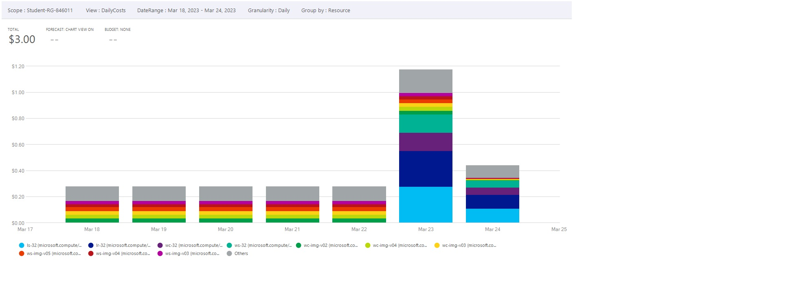
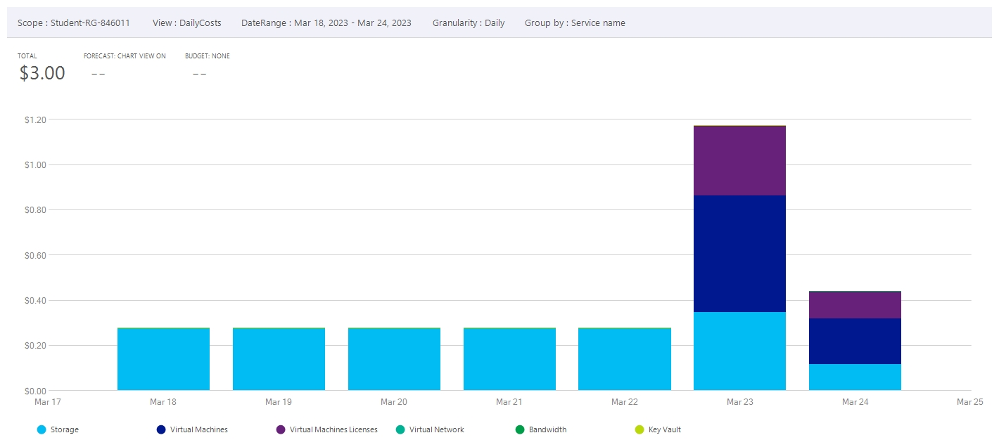
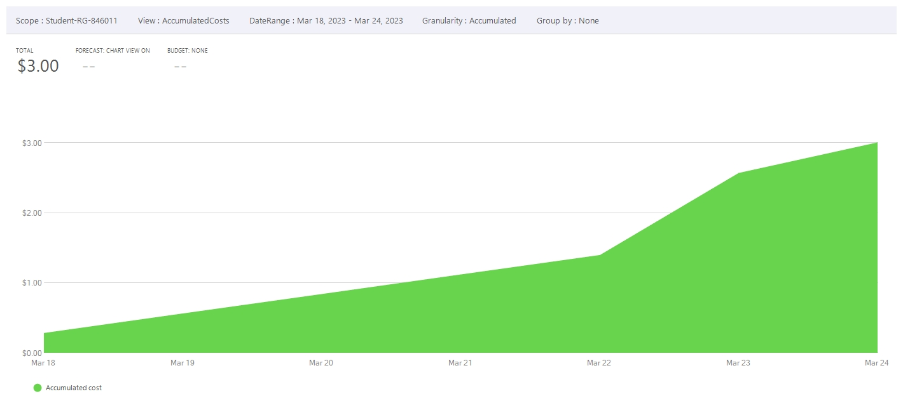
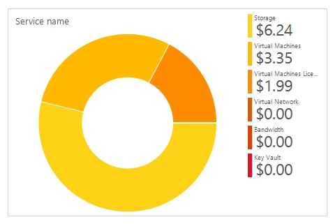
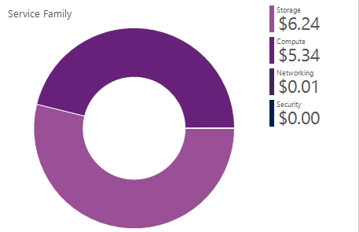
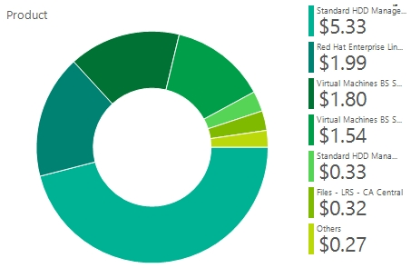

# Checkpoint7 Submission

- **COURSE INFORMATION: CSN400NAA**
- **STUDENT’S NAME: Evan Scheller**
- **STUDENT'S NUMBER: 183766211**
- **GITHUB USER ID: 183766211-myseneca**
- **TEACHER’S NAME: Atoosa Nasiri**

### Table of Contents

1. [Part A – Logging Packets with Specific Prefixes](#part-a---logging-packets-with-specific-prefixes)
2. [Part B - Filtering Logged Packets](#part-b---filtering-logged-packets)
3. [Part C - Analyzing Logged Packets](#part-c---analyzing-logged-packets)
4. [Part D - Azure Cost Analysis Charts](#part-d---azure-cost-analysis-charts)

## Part A - Logging Packets with Specific Prefixes
[Firewall script (lr_firewall_log.sh)](https://github.com/183766211-myseneca/CSN400-Capstone/blob/main/Checkpoint7/files/lr_firewall_log.sh)

[Firewall output (lr_firewalls_log.txt)](https://github.com/183766211-myseneca/CSN400-Capstone/blob/main/Checkpoint7/files/lr_firewalls_log.txt)

```
Chain INPUT (policy ACCEPT 6 packets, 240 bytes)
num   pkts bytes target     prot opt in     out     source               destination
1     2290  150K LOG        tcp  --  *      *       10.52.19.0/24        192.168.32.36        tcp dpt:22 limit: avg 10/sec burst 5 LOG flags 0 level 4 prefix "SSH INPUT LR-32 - "
2        6   312 LOG        tcp  --  *      *       10.52.19.0/24        0.0.0.0/0            state NEW tcp dpt:22 limit: avg 10/sec burst 5 LOG flags 0 level 4 prefix "SSH NEW TO LR-32 - "
3     9937 1853K ACCEPT     tcp  --  *      *       0.0.0.0/0            0.0.0.0/0            state RELATED,ESTABLISHED
4        0     0 ACCEPT     icmp --  *      *       0.0.0.0/0            0.0.0.0/0
5        0     0 ACCEPT     all  --  lo     *       0.0.0.0/0            0.0.0.0/0
6        6   312 ACCEPT     tcp  --  *      *       10.52.19.0/24        0.0.0.0/0            state NEW tcp dpt:22
7        6   432 LOG        all  --  *      *       0.0.0.0/0            0.0.0.0/0            limit: avg 10/sec burst 5 LOG flags 0 level 4 prefix "TO_DROP_INPUT"
8        6   432 DROP       all  --  *      *       0.0.0.0/0            0.0.0.0/0

Chain FORWARD (policy ACCEPT 1 packets, 91 bytes)
num   pkts bytes target     prot opt in     out     source               destination
1       21  3861 LOG        tcp  --  *      *       10.52.19.0/24        172.17.32.37         tcp dpt:22 limit: avg 10/sec burst 5 LOG flags 0 level 4 prefix "SSH FORWARD TO LS-32 - "
2       19  2985 LOG        tcp  --  *      *       172.17.32.37         10.52.19.0/24        tcp spt:22 limit: avg 10/sec burst 5 LOG flags 0 level 4 prefix "SSH FORWARD FROM LS-32 - "
3       28  4517 ACCEPT     tcp  --  *      *       10.52.19.0/24        172.17.32.32/27      tcp dpt:22
4       27  4701 ACCEPT     tcp  --  *      *       172.17.32.32/27      10.52.19.0/24        tcp spt:22
5      747 33403 LOG        tcp  --  *      *       10.52.19.0/24        172.17.32.36         tcp dpt:3389 limit: avg 10/sec burst 5 LOG flags 0 level 4 prefix "RDP FORWARD TO WS-32 - "
6      757 72212 LOG        tcp  --  *      *       172.17.32.36         10.52.19.0/24        tcp spt:3389 limit: avg 10/sec burst 5 LOG flags 0 level 4 prefix "RDP FORWARD FROM WS-32 - "
7      903 47517 ACCEPT     tcp  --  *      *       10.52.19.0/24        172.17.32.32/27      tcp dpt:3389
8      930  172K ACCEPT     tcp  --  *      *       172.17.32.32/27      10.52.19.0/24        tcp spt:3389
9        0     0 LOG        tcp  --  *      *       0.0.0.0/0            172.17.32.36         tcp dpt:53 limit: avg 10/sec burst 5 LOG flags 0 level 4 prefix "DNS TCP FORWARD TO WS-32 - "
10       0     0 LOG        tcp  --  *      *       172.17.32.36         0.0.0.0/0            tcp spt:53 limit: avg 10/sec burst 5 LOG flags 0 level 4 prefix "DNS TCP FORWARD FROM WS-32 - "
11      36  2469 LOG        udp  --  *      *       0.0.0.0/0            172.17.32.36         udp dpt:53 limit: avg 10/sec burst 5 LOG flags 0 level 4 prefix "DNS UDP FORWARD TO WS-32 - "
12      33  5397 LOG        udp  --  *      *       172.17.32.36         0.0.0.0/0            udp spt:53 limit: avg 10/sec burst 5 LOG flags 0 level 4 prefix "DNS UDP FORWARD FROM WS-32 - "
13       0     0 ACCEPT     tcp  --  *      *       0.0.0.0/0            172.17.32.36         tcp dpt:53
14       0     0 ACCEPT     tcp  --  *      *       172.17.32.36         0.0.0.0/0            tcp spt:53
15      36  2469 ACCEPT     udp  --  *      *       0.0.0.0/0            172.17.32.36         udp dpt:53
16      33  5397 ACCEPT     udp  --  *      *       172.17.32.36         0.0.0.0/0            udp spt:53
17       5   352 LOG        tcp  --  *      *       10.52.19.0/24        172.17.32.37         tcp dpt:3306 limit: avg 10/sec burst 5 LOG flags 0 level 4 prefix "MySQL FORWARD TO LS-32 - "
18       5   724 LOG        tcp  --  *      *       172.17.32.37         10.52.19.0/24        tcp spt:3306 limit: avg 10/sec burst 5 LOG flags 0 level 4 prefix "MySQL FORWARD FROM LS-32 - "
19       8   477 ACCEPT     tcp  --  *      *       10.52.19.0/24        172.17.32.37         tcp dpt:3306
20       8   914 ACCEPT     tcp  --  *      *       172.17.32.37         10.52.19.0/24        tcp spt:3306
21      10   922 LOG        tcp  --  *      *       10.52.19.0/24        172.17.32.37         tcp dpt:80 limit: avg 10/sec burst 5 LOG flags 0 level 4 prefix "HTTP FORWARD TO LS-32 - "
22      11  1694 LOG        tcp  --  *      *       172.17.32.37         10.52.19.0/24        tcp spt:80 limit: avg 10/sec burst 5 LOG flags 0 level 4 prefix "HTTP FORWARD FROM LS-32 - "
23      11  1396 ACCEPT     tcp  --  *      *       10.52.19.0/24        172.17.32.37         tcp dpt:80
24      11  1694 ACCEPT     tcp  --  *      *       172.17.32.37         10.52.19.0/24        tcp spt:80
25       9   873 LOG        tcp  --  *      *       10.52.19.0/24        172.17.32.36         tcp dpt:80 limit: avg 10/sec burst 5 LOG flags 0 level 4 prefix "HTTP FORWARD TO WS-32 - "
26      10  2781 LOG        tcp  --  *      *       172.17.32.36         10.52.19.0/24        tcp spt:80 limit: avg 10/sec burst 5 LOG flags 0 level 4 prefix "HTTP FORWARD FROM WS-32 - "
27      11  1387 ACCEPT     tcp  --  *      *       10.52.19.0/24        172.17.32.36         tcp dpt:80
28      10  2781 ACCEPT     tcp  --  *      *       172.17.32.36         10.52.19.0/24        tcp spt:80
29      12   579 LOG        tcp  --  *      *       10.52.19.0/24        172.17.32.36         tcp dpt:21 limit: avg 10/sec burst 5 LOG flags 0 level 4 prefix "FTP CONTROL PLANE FORWARD TO "
30      12   771 LOG        tcp  --  *      *       172.17.32.36         10.52.19.0/24        tcp spt:21 limit: avg 10/sec burst 5 LOG flags 0 level 4 prefix "FTP CONTROL PLANE FORWARD FRO"
31      19   919 ACCEPT     tcp  --  *      *       10.52.19.0/24        172.17.32.36         tcp dpt:21
32      19  1304 ACCEPT     tcp  --  *      *       172.17.32.36         10.52.19.0/24        tcp spt:21
33       5  3239 LOG        tcp  --  *      *       10.52.19.0/24        172.17.32.36         tcp dpts:50000:51000 limit: avg 10/sec burst 5 LOG flags 0 level 4 prefix "FTP DATA PLANE FORWARD TO WS-"
34       5   496 LOG        tcp  --  *      *       172.17.32.36         10.52.19.0/24        tcp spts:50000:51000 limit: avg 10/sec burst 5 LOG flags 0 level 4 prefix "FTP DATA PLANE FORWARD FROM W"
35       9  3411 ACCEPT     tcp  --  *      *       10.52.19.0/24        172.17.32.36         tcp dpts:50000:51000
36       7   576 ACCEPT     tcp  --  *      *       172.17.32.36         10.52.19.0/24        tcp spts:50000:51000
37       0     0 LOG        all  --  *      *       0.0.0.0/0            0.0.0.0/0            limit: avg 10/sec burst 5 LOG flags 0 level 4 prefix "TO_DROP_FORWARD"
38       0     0 DROP       all  --  *      *       0.0.0.0/0            0.0.0.0/0

Chain OUTPUT (policy ACCEPT 129 packets, 17804 bytes)
num   pkts bytes target     prot opt in     out     source               destination
1     1207  194K LOG        tcp  --  *      *       192.168.32.36        10.52.19.0/24        tcp spt:22 limit: avg 10/sec burst 5 LOG flags 0 level 4 prefix "SSH OUTPUT WC-32"
2    11539 3193K ACCEPT     all  --  *      *       0.0.0.0/0            0.0.0.0/0
```


## Part B - Filtering Logged Packets
[8 packets log (logged_packets.log)](https://github.com/183766211-myseneca/CSN400-Capstone/blob/main/Checkpoint7/files/logged_packets.log)

 ```
A NEW SSH session from Windows Client to Linux Router:
Mar 24 02:48:42 LR-32 kernel: SSH NEW TO LR-32 - IN=eth0 OUT= MAC=60:45:bd:5d:50:52:c0:d6:82:62:ec:09:08:00 SRC=10.52.19.4 DST=192.168.32.36 LEN=52 TOS=0x00 PREC=0x00 TTL=128 ID=49621 DF PROTO=TCP SPT=53283 DPT=22 WINDOW=64240 RES=0x00 SYN URGP=0

 A NEW SSH session response from Linux Router to Windows Client
Mar 24 03:16:40 LR-32 kernel: SSH OUTPUT WC-32IN= OUT=eth0 SRC=192.168.32.36 DST=10.52.19.4 LEN=84 TOS=0x08 PREC=0x40 TTL=64 ID=25640 DF PROTO=TCP SPT=22 DPT=52938 WINDOW=296 RES=0x00 ACK PSH URGP=0

A DNS request from Windows Client, requesting the FQDN of the IIS server:
Mar 24 03:20:13 LR-32 kernel: DNS UDP FORWARD FROM WS-32 - IN=eth0 OUT=eth0 MAC=60:45:bd:5d:50:52:c0:d6:82:62:ec:09:08:00 SRC=172.17.32.36 DST=10.52.19.4 LEN=82 TOS=0x00 PREC=0x00 TTL=127 ID=59646 PROTO=UDP SPT=53 DPT=60866 LEN=62

An HTTP request from Windows Client to the IIS Server
Mar 24 03:24:29 LR-32 kernel: HTTP FORWARD TO WS-32 - IN=eth0 OUT=eth0 MAC=60:45:bd:5d:50:52:c0:d6:82:62:ec:09:08:00 SRC=10.52.19.4 DST=172.17.32.36 LEN=52 TOS=0x00 PREC=0x00 TTL=127 ID=35932 DF PROTO=TCP SPT=53491 DPT=80 WINDOW=2051 RES=0x00 ACK URGP=0

A DNS request from Windows Client, requesting the FQDN of the APACHE server
Mar 24 03:37:49 LR-32 kernel: DNS UDP FORWARD FROM WS-32 - IN=eth0 OUT=eth0 MAC=60:45:bd:5d:50:52:c0:d6:82:62:ec:09:08:00 SRC=172.17.32.36 DST=10.52.19.4 LEN=201 TOS=0x00 PREC=0x00 TTL=127 ID=59697 PROTO=UDP SPT=53 DPT=64692 LEN=181

An HTTP request from Windows Client to the APACHE Server
Mar 24 03:38:42 LR-32 kernel: HTTP FORWARD TO LS-32 - IN=eth0 OUT=eth0 MAC=60:45:bd:5d:50:52:c0:d6:82:62:ec:09:08:00 SRC=10.52.19.4 DST=172.17.32.37 LEN=40 TOS=0x00 PREC=0x00 TTL=127 ID=9593 DF PROTO=TCP SPT=53581 DPT=80 WINDOW=2052 RES=0x00 ACK URGP=0

A MySQL request from Windows Client to Linux Server
Mar 24 03:41:31 LR-32 kernel: MySQL FORWARD TO LS-32 - IN=eth0 OUT=eth0 MAC=60:45:bd:5d:50:52:c0:d6:82:62:ec:09:08:00 SRC=10.52.19.4 DST=172.17.32.37 LEN=45 TOS=0x00 PREC=0x00 TTL=127 ID=9606 DF PROTO=TCP SPT=53614 DPT=3306 WINDOW=2050 RES=0x00 ACK PSH URGP=0

An FTP request from Windows Client to Windows Server
Mar 24 03:42:29 LR-32 kernel: FTP CONTROL PLANE FORWARD TO IN=eth0 OUT=eth0 MAC=60:45:bd:5d:50:52:c0:d6:82:62:ec:09:08:00 SRC=10.52.19.4 DST=172.17.32.36 LEN=40 TOS=0x00 PREC=0x00 TTL=127 ID=35992 DF PROTO=TCP SPT=53634 DPT=21 WINDOW=2050 RES=0x00 ACK URGP=0

 ```

## Part C - Analyzing Logged Packets
 
| Packet ID | Date | MAC Address | Protocol | Source Address | Dest. Address | Source Port | Dest. Port | Packet Length | LOG Prefix | Time To Live |
| - | - | - | - | - | - | - | - | - | - | - |
| 49621 | Mar 24 | 60:45:bd:5d:50:52:c0:d6:82:62:ec:09:08:00 | TCP | 10.52.19.4 | 192.168.32.36 | 53283 | 22 | 52 | SSH NEW TO LR-32 | 128 |
| 25640 | Mar 24 | - | TCP | 192.168.32.36 | 10.52.19.4 | 22 | 52938 | 84 | SSH OUTPUT WC-32 | 64 |
| 59646 | Mar 24 | 60:45:bd:5d:50:52:c0:d6:82:62:ec:09:08:00 | UDP | 172.17.32.36 | 10.52.19.4 | 53 | 60866 | 62 | DNS UDP FORWARD FROM WS-32 | 127 |
| 35932 | Mar 24 | 60:45:bd:5d:50:52:c0:d6:82:62:ec:09:08:00 | TCP | 10.52.19.4 | 172.17.32.36 | 53491 | 80 | 52 | HTTP FORWARD TO WS-32 | 127 |
| 59697 | Mar 24 | 60:45:bd:5d:50:52:c0:d6:82:62:ec:09:08:00 | UDP | 172.17.32.36 | 10.52.19.4 | 53 | 64692 | 201 | DNS UDP FORWARD FROM WS-32 | 127 |
| 9593 | Mar 24 | 60:45:bd:5d:50:52:c0:d6:82:62:ec:09:08:00 | TCP | 10.52.19.4 | 172.17.32.37 | 53581 | 80 | 40 | HTTP FORWARD TO LS-32 | 127 |
| 9606 | Mar 24 | 60:45:bd:5d:50:52:c0:d6:82:62:ec:09:08:00 | Protocol | 10.52.19.4 | 172.17.32.37 | 53614 | 3306 | 45 | MySQL FORWARD TO LS-32 | 127 |
| 35992 | Mar 24 | 60:45:bd:5d:50:52:c0:d6:82:62:ec:09:08:00 | Protocol | 10.52.19.4 | 172.17.32.36 | 53634 | 21 | 40 | FTP CONTROL PLANE FORWARD TO | 127 |


1. What is Packet ID? Does it follow a sequence or is it random? How can you prove / demonstrate your answer?
2. Why Windows Client Source Port is not related to the kind of service requested? Why for example SSH request is coming from a random Source Port instead of port 22? Is there any way you can fix request port number? If yes give example, if no elaborate?
3. Answer previous question for DNS service? Can you explain the random Source Port issue?
4. What is MAC address? Can you find the MAC addresses of your Network
Interface Cards in Azure Portal? How?

## Part D - Azure Cost Analysis Charts

### Daily resource cost of last 7 days.


### Daily service cost of last 7 days.


### Accumulated resource cost area chart, last 7 days.


### Cost by service name, past 30 days.


### Cost by service family, past 30 days.


### Cost by product, past 30 days.

