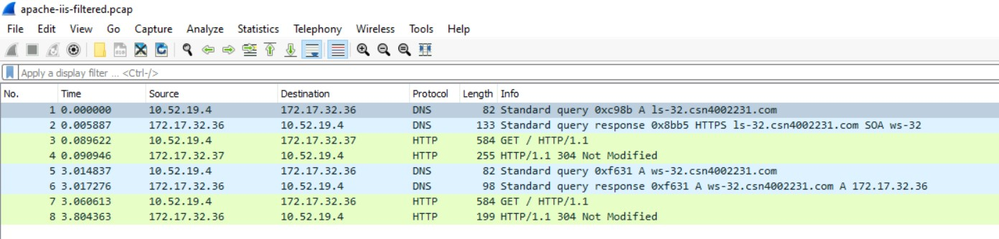
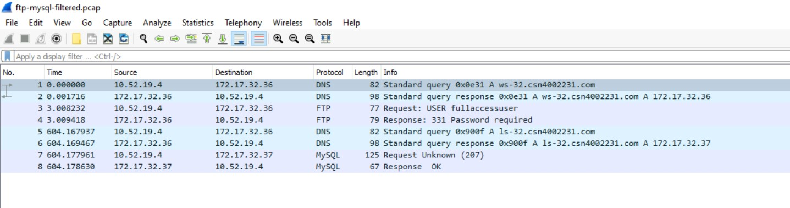

# Checkpoint8 Submission

- **COURSE INFORMATION: CSN400NAA**
- **STUDENT’S NAME: Evan Scheller**
- **STUDENT'S NUMBER: 183766211**
- **GITHUB USER ID: 183766211-myseneca**
- **TEACHER’S NAME: Atoosa Nasiri**

### Table of Contents

1. [Part A – Logging and Analyzing DNS and HTTP Traffic](#part-a---logging-and-analyzing-dns-and-http-traffic)
2. [Part B – Logging and Analyzing FTP and MySQL Traffic](#part-b---logging-and-analyzing-ftp-and-mysql-traffic)
3. [Part C – Adjusting firewalls to DROP and LOG Traffic](#part-c---adjusting-firewalls-to-drop-and-log-traffic)
4. [Part D - Azure Cost Analysis Charts](#part-d---azure-cost-analysis-charts)

## Part A – Logging and Analyzing DNS and HTTP Traffic
Apache and IIS filtered packets.

## Part B – Logging and Analyzing FTP and MySQL Traffic
FTP and MySQL filtered packets.

## Part C – Adjusting firewalls to DROP and LOG Traffic
New firewall rules for dropping specified packets.
```
iptables -A FORWARD -p tcp -d 10.52.19.0/24 -s 172.17.32.37 --sport 22 -j DROP 
iptables -A FORWARD -p tcp -s 10.52.19.0/24 -d 172.17.32.36 --dport 21 -j DROP
```
## Part D - Azure Cost Analysis Charts