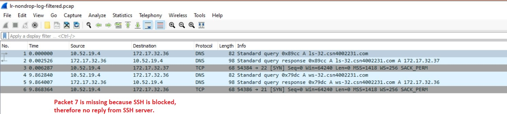
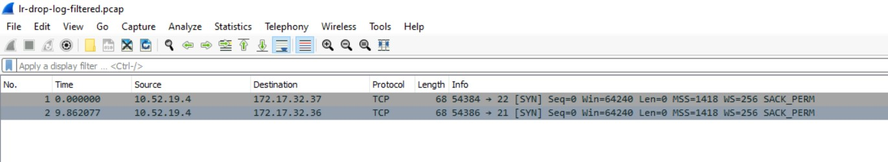

# Checkpoint8 Submission

- **COURSE INFORMATION: CSN400NAA**
- **STUDENT’S NAME: Evan Scheller**
- **STUDENT'S NUMBER: 183766211**
- **GITHUB USER ID: 183766211-myseneca**
- **TEACHER’S NAME: Atoosa Nasiri**

### Table of Contents

1. [Part A – Logging and Analyzing DNS and HTTP Traffic](#part-a---logging-and-analyzing-dns-and-http-traffic)
2. [Part B – Logging and Analyzing FTP and MySQL Traffic](#part-b---logging-and-analyzing-ftp-and-mysql-traffic)
3. [Part C – Adjusting firewalls to DROP and LOG Traffic](#part-c---adjusting-firewalls-to-drop-and-log-traffic)
4. [Part D - Azure Cost Analysis Charts](#part-d---azure-cost-analysis-charts)

## Part A – Logging and Analyzing DNS and HTTP Traffic
Apache and IIS filtered packets.

## Part B – Logging and Analyzing FTP and MySQL Traffic
FTP and MySQL filtered packets.

## Part C – Adjusting firewalls to DROP and LOG Traffic
New firewall rules for dropping specified packets.
```
iptables -A FORWARD -p tcp -d 10.52.19.0/24 -s 172.17.32.37 --sport 22 -j DROP 
iptables -A FORWARD -p tcp -s 10.52.19.0/24 -d 172.17.32.36 --dport 21 -j DROP
```
SSH and FTP attempts filtered packets - lr-nondrop-log-filtered.


Snippet of log messages for dropped packets.
```
Mar 29 23:33:41 LR-32 kernel: FTP CONTROL PLANE FORWARD TO IN=eth0 OUT=eth0 MAC=00:22:48:ae:1d:1c:fc:bd:67:90:0d:eb:08:00 SRC=10.52.19.4 DST=172.17.32.36 LEN=52 TOS=0x00 PREC=0x00 TTL=127 ID=60087 DF PROTO=TCP SPT=54386 DPT=21 WINDOW=64240 RES=0x00 SYN URGP=0
Mar 29 23:33:31 LR-32 kernel: SSH FORWARD TO LS-32 - IN=eth0 OUT=eth0 MAC=00:22:48:ae:1d:1c:fc:bd:67:90:0d:eb:08:00 SRC=10.52.19.4 DST=172.17.32.37 LEN=52 TOS=0x00 PREC=0x00 TTL=127 ID=59889 DF PROTO=TCP SPT=54384 DPT=22 WINDOW=64240 RES=0x00 SYN URGP=0
```
SSH and FTP attempts filtered packets - lr-drop-log-filtered.


## Part D - Azure Cost Analysis Charts