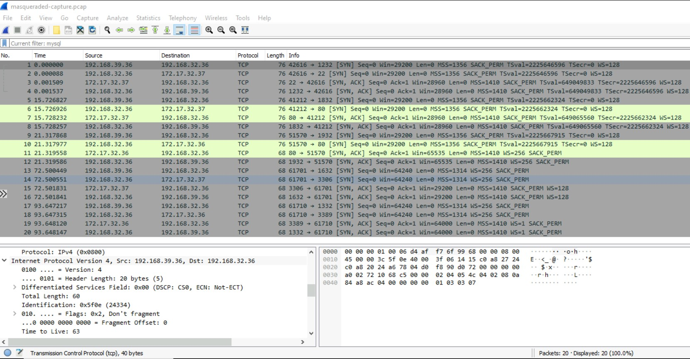
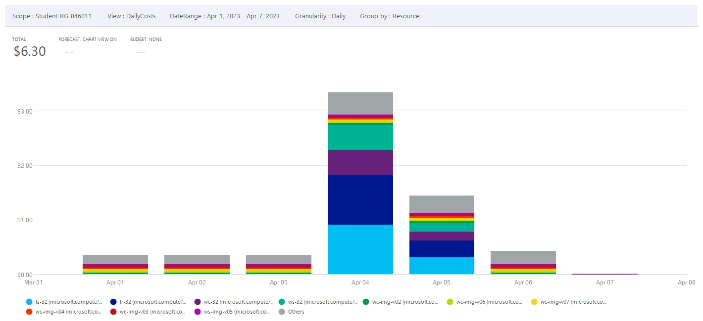
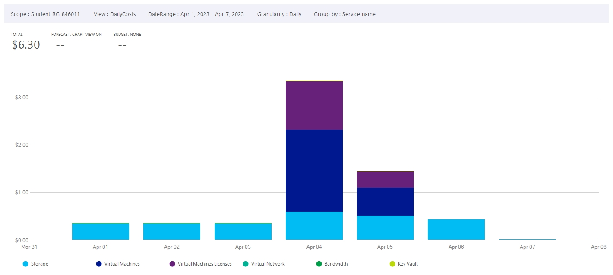
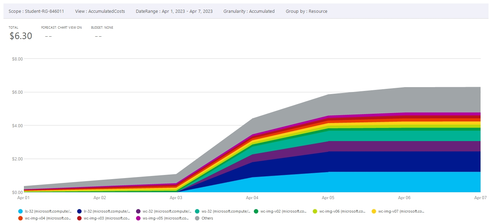
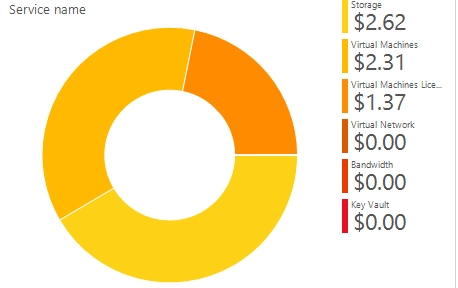
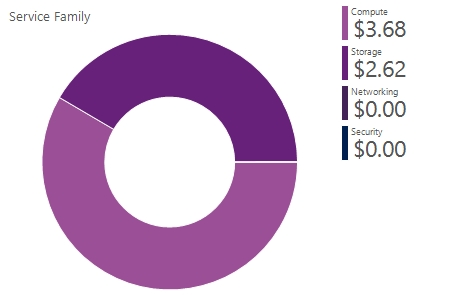
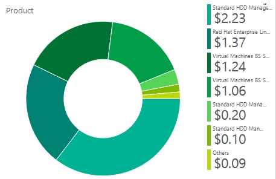

# Checkpoint9 Submission

- **COURSE INFORMATION: CSN400NAA**
- **STUDENT’S NAME: Evan Scheller**
- **STUDENT'S NUMBER: 183766211**
- **GITHUB USER ID: 183766211-myseneca**
- **TEACHER’S NAME: Atoosa Nasiri**

### Table of Contents

1. [Part A - Route Table Updates](#part-a---route-table-updates)
2. [Part B - Port Forwarding Basic Connectivity](#part-b---port-forwarding-basic-connectivity)
3. [Part C - Logging and Isolating Masqueraded Packets](#part-c---logging-and-isolating-masqueraded-packets)
4. [Part D - Azure Cost Analysis Charts](#part-d---azure-cost-analysis-charts)

## Part A - Route Table Updates
Route tables: `az network route-table list -o table`
```
DisableBgpRoutePropagation    Location       Name      ProvisioningState    ResourceGroup      ResourceGuid
----------------------------  -------------  --------  -------------------  -----------------  ------------------------------------
True                          canadacentral  RT-32     Succeeded            Student-RG-846011  2e1554ad-685c-4f84-bccd-75e54ca3a592
False                         canadacentral  RT-EX-32  Succeeded            Student-RG-846011  0fb1ce35-b760-49b5-9487-72f5deb2ff21
```
### RT-EX-32 
Route 'Route-to-Hub': `az network route-table route show -g Student-RG-846011 --route-table-name RT-EX-32 -n Route-to-Hub -o table`

```
AddressPrefix     HasBgpOverride    Name          NextHopIpAddress    NextHopType       ProvisioningState    ResourceGroup
----------------  ----------------  ------------  ------------------  ----------------  -------------------  -----------------
192.168.39.32/27  False             Route-to-Hub  192.168.99.36       VirtualAppliance  Succeeded            Student-RG-846011
```
Associated subnet: `az network vnet subnet show -g Student-RG-846011 -n SN1 --vnet-name Server-32 -o table`
```
AddressPrefix    Name    PrivateEndpointNetworkPolicies    PrivateLinkServiceNetworkPolicies    ProvisioningState    ResourceGroup
---------------  ------  --------------------------------  -----------------------------------  -------------------  -----------------
172.17.32.32/27  SN1     Disabled                          Enabled                              Succeeded            Student-RG-846011
```

### RT-32 
Route 'External-Router': `az network route-table route show -g Student-RG-846011 --route-table-name RT-32 -n External-Router -o table`
```
AddressPrefix     HasBgpOverride    Name             NextHopIpAddress    NextHopType       ProvisioningState    ResourceGroup
----------------  ----------------  ---------------  ------------------  ----------------  -------------------  -----------------
192.168.39.32/27  False             External-Router  192.168.32.36       VirtualAppliance  Succeeded            Student-RG-846011
```
Associated subnet: `az network vnet subnet show -g Student-RG-846011 -n SN1 --vnet-name Router-32 -o table`
```
AddressPrefix    Name    PrivateEndpointNetworkPolicies    PrivateLinkServiceNetworkPolicies    ProvisioningState    ResourceGroup
---------------  ------  --------------------------------  -----------------------------------  -------------------  -----------------
172.17.32.32/27  SN1     Disabled                          Enabled                              Succeeded            Student-RG-846011
```

## Part B - Port Forwarding Basic Connectivity
### nat_basic_connectivity.sh
```
# to flush NAT tables
iptables -t nat -F

#LOGGING
iptables -t nat -A PREROUTING -p tcp --dport 1832 -j LOG --log-prefix "Prerouting Apache"
# to allow other students to access APACHE server
iptables -t nat -A PREROUTING -p tcp --dport 1832 -j DNAT --to-destination 172.17.32.37:80

#LOGGING
iptables -t nat -A PREROUTING -p tcp --dport 1632 -j LOG --log-prefix "Prerouting MySQL"
# to allow other students to access MySQL server
iptables -t nat -A PREROUTING -p tcp --dport 1632 -j DNAT --to-destination 172.17.32.37:3306

#LOGGING
iptables -t nat -A PREROUTING -p tcp --dport 1232 -j LOG --log-prefix "Prerouting SSH"
# to allow other students to access Linux server - SSH
iptables -t nat -A PREROUTING -p tcp --dport 1232 -j DNAT --to-destination 172.17.32.37:22

#LOGGING
iptables -t nat -A PREROUTING -p tcp --dport 1932 -j LOG --log-prefix "Prerouting IIS"
# to allow other students to access IIS server
iptables -t nat -A PREROUTING -p tcp --dport 1932 -j DNAT --to-destination 172.17.32.36:80

#LOGGING
iptables -t nat -A PREROUTING -p tcp --dport 1332 -j LOG --log-prefix "Prerouting RDP"
# to allow other students to access Windows server - RDP
iptables -t nat -A PREROUTING -p tcp --dport 1332 -j DNAT --to-destination 172.17.32.36:3389

#POSTROUTING
iptables -t nat -A POSTROUTING -o eth0 -j MASQUERADE
```

### firewalls-cp9.sh
- submitted through blackboard.


## Part C - Logging and Isolating Masqueraded Packets
### masqueraded-logged.log:
```
Apr  5 01:52:44 LR-32 kernel: log-captures-masquerading-httIN=eth0 OUT=eth0 MAC=00:22:48:3d:96:23:d4:af:f7:6f:99:68:08:00 SRC=192.168.39.36 DST=172.17.32.36 LEN=41 TOS=0x00 PREC=0x00 TTL=125 ID=2091 DF PROTO=TCP SPT=61870 DPT=80 WINDOW=2052 RES=0x00 ACK URGP=0
Apr  5 01:52:15 LR-32 kernel: log-captures-masquerading-httIN=eth0 OUT=eth0 MAC=00:22:48:3d:96:23:d4:af:f7:6f:99:68:08:00 SRC=192.168.39.36 DST=172.17.32.37 LEN=40 TOS=0x00 PREC=0x00 TTL=125 ID=2089 DF PROTO=TCP SPT=61882 DPT=80 WINDOW=2052 RES=0x00 ACK URGP=0
Apr  5 01:49:28 LR-32 kernel: log-captures-masquerading-mysIN=eth0 OUT=eth0 MAC=00:22:48:3d:96:23:d4:af:f7:6f:99:68:08:00 SRC=192.168.39.36 DST=172.17.32.37 LEN=40 TOS=0x00 PREC=0x00 TTL=125 ID=2044 DF PROTO=TCP SPT=61815 DPT=3306 WINDOW=2052 RES=0x00 ACK FIN URGP=0
Apr  5 01:50:34 LR-32 kernel: log-captures-masquerading-rdpIN=eth0 OUT=eth0 MAC=00:22:48:3d:96:23:d4:af:f7:6f:99:68:08:00 SRC=192.168.39.36 DST=172.17.32.36 LEN=40 TOS=0x00 PREC=0x00 TTL=125 ID=2067 DF PROTO=TCP SPT=61834 DPT=3389 WINDOW=0 RES=0x00 ACK RST URGP=0
Apr  5 01:48:33 LR-32 kernel: log-captures-masquerading-sshIN=eth0 OUT=eth0 MAC=00:22:48:3d:96:23:d4:af:f7:6f:99:68:08:00 SRC=192.168.39.36 DST=172.17.32.37 LEN=104 TOS=0x00 PREC=0x00 TTL=62 ID=41332 DF PROTO=TCP SPT=44432 DPT=22 WINDOW=268 RES=0x00 ACK PSH URGP=0
```
### Masqueraded-capture.pcap screenshot



## Part D - Azure Cost Analysis Charts

### Daily resource cost of last 7 days.


### Daily service cost of last 7 days.


### Accumulated resource cost area chart, last 7 days.


### Cost by service name, past 30 days.


### Cost by service family, past 30 days.


### Cost by product, past 30 days.
